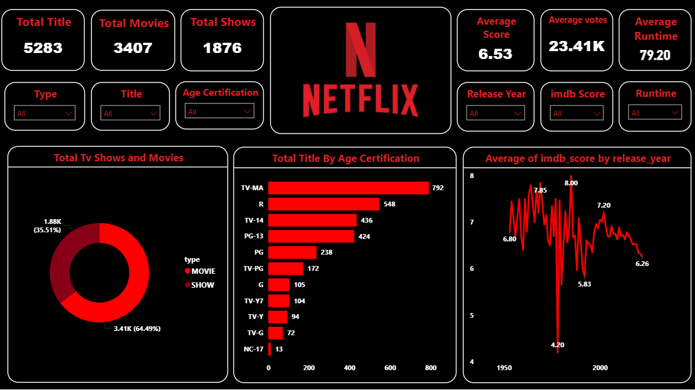

# Netflix Analysis Dashboard

## Project Overview
This Power BI dashboard analyzes Netflix movies and TV shows to provide insights into content distribution, ratings, genres, countries, and release trends.

## Tools Used
- Power BI
- Excel / CSV Dataset

## Key Insights
- Total Movies and TV Shows
- Content Distribution by Type
- Top Genres on Netflix
- Rating-wise Analysis
- Country-wise Content Distribution
- Release Year Trends

## Files Included
- Netflix_Analysis.pbix
- Netflix_Dashboard.png

## Dashboard Preview

